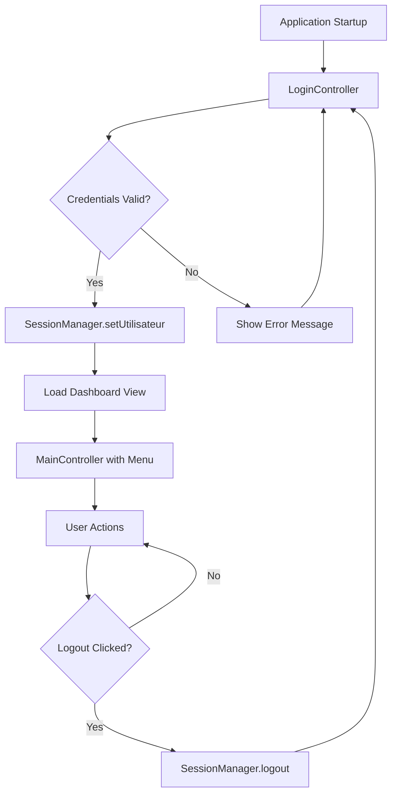
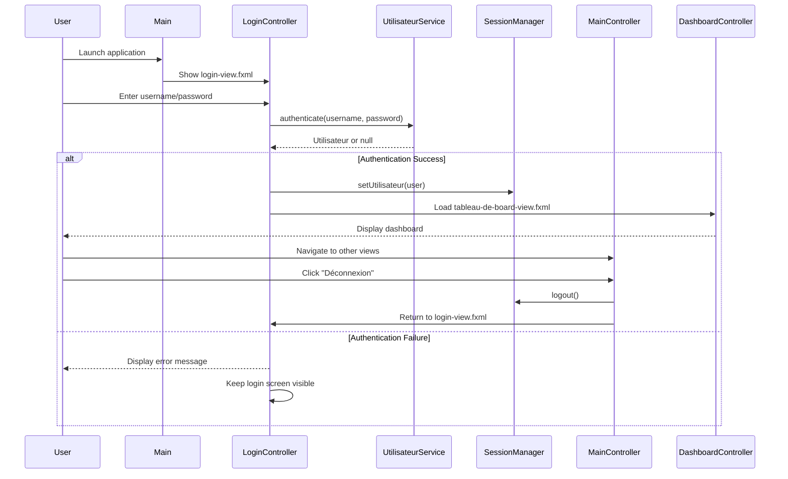

# Design Document: Login System

## Overview

This design implements a professional startup login screen for the industrial JavaFX application, establishing secure authentication before main application access. The system intercepts application startup to present a visually attractive login interface, validates credentials against the existing authentication infrastructure (UtilisateurService, BCrypt, SessionManager), and redirects authenticated users to the dashboard view. The design follows the existing Lacroix Electronics visual language with teal/dark color palette, modern rounded borders, and subtle shadows for an industrial-grade professional appearance.

## Architecture

The login system integrates as the application entry point, modifying the startup flow to intercept access and establish authentication before presenting the main interface.



### Application Flow



## Components and Interfaces

### Component 1: LoginController

**Purpose**: Manages the login view, handles user input, validates credentials, and controls navigation to dashboard or error display.

**Interface**:
```java
public class LoginController {
    @FXML private TextField usernameField;
    @FXML private PasswordField passwordField;
    @FXML private Button btnLogin;
    @FXML private Label errorLabel;
    
    private UtilisateurService utilisateurService;
    
    @FXML public void initialize();
    @FXML private void handleLogin();
    private void showError(String message);
    private void navigateToDashboard();
}
```

**Responsibilities**:
- Capture username and password input from FXML fields
- Validate non-empty credentials before authentication attempt
- Invoke UtilisateurService.authenticate() with provided credentials
- On success: store user in SessionManager and navigate to dashboard
- On failure: display French error message "Nom d'utilisateur ou mot de passe incorrect"
- Clear password field on failed attempt for security
- Handle Enter key press to trigger login action

### Component 2: Main Application Entry

**Purpose**: Modified startup class that launches login screen instead of main view.

**Interface**:
```java
public class Main extends Application {
    @Override
    public void start(Stage primaryStage) throws IOException;
    public static void main(String[] args);
}
```

**Responsibilities**:
- Load login-view.fxml as the initial scene
- Set appropriate window title: "Connexion - Lacroix Electronics"
- Configure stage properties (minimum size, icon if available)
- Prevent window closing during critical authentication operations
- Launch application with login as entry point

### Component 3: MainController Logout Integration

**Purpose**: Add logout functionality to existing main menu, allowing users to end session and return to login.

**Interface Addition**:
```java
public class MainController {
    // Existing fields...
    @FXML private Button btnDeconnexion;
    
    // New method
    @FXML private void handleLogout();
    private void returnToLogin();
}
```

**Responsibilities**:
- Add "Déconnexion" button to main-view.fxml header
- Clear SessionManager on logout action
- Close current stage and reopen login window
- Ensure clean session termination

### Component 4: SessionManager (Existing)

**Purpose**: Singleton managing current authenticated user session (already implemented).

**Interface** (Reference Only):
```java
public class SessionManager {
    private Utilisateur utilisateurCourant;
    
    public static SessionManager getInstance();
    public void setUtilisateur(Utilisateur user);
    public Utilisateur getUtilisateur();
    public boolean isAuthenticated();
    public void logout();
}
```

### Component 5: UtilisateurService (Existing)

**Purpose**: Service layer for user authentication and management (already implemented).

**Interface** (Reference Only):
```java
public class UtilisateurService {
    public Utilisateur authenticate(String username, String password);
    public Utilisateur findByUsername(String username);
}
```

## Data Models

### Model 1: Utilisateur (Existing)

```java
public class Utilisateur {
    private int id;
    private String nom;
    private String username;
    private String passwordHash;
    private Role role;  // OPERATEUR, TECHNICIEN, INGENIEUR
    private boolean actif;
    private Timestamp dateCreation;
}
```

**Validation Rules**:
- username must not be null or empty
- passwordHash is BCrypt-hashed, never plain text
- role must be one of three enum values
- actif must be true for authentication to succeed

## UI Design Specification

### Login View Layout (login-view.fxml)

**Visual Structure**:
- Centered vertical layout with maximum width 420px
- White card container with rounded corners (radius: 14px)
- Subtle drop shadow for depth (gaussian blur: 10px, opacity: 0.06)
- Lacroix Electronics branding at top
- Username and password input fields with modern styling
- Primary action button "Se connecter" in teal (#346771)
- Error message label below button (initially invisible)

**Color Palette** (from existing style.css):
- Primary Teal: #346771
- Teal Light: #3A98A5
- Dark Text: #21262A
- Medium Gray: #6F8D94
- Light Background: #F8FAFC
- Error Orange: #D9691D
- White: #ffffff
- Border Gray: #E2E8F0

**Typography**:
- Font Family: "Segoe UI", Arial, sans-serif
- Title: 22px bold, color #21262A
- Subtitle: 13px normal, color #6F8D94
- Input Fields: 13px normal, color #21262A
- Button: 14px bold, color #ffffff
- Error Text: 12px normal, color #D9691D

**Input Field Styling**:
- Background: #ffffff
- Border: 1px solid #d0d5dd
- Border Radius: 8px
- Padding: 10px 14px
- Focus State: Border color #346771 with subtle shadow

**Button Styling**:
- Background: Linear gradient (#346771 to #3A98A5)
- Text: #ffffff, bold, 14px
- Padding: 12px 24px
- Border Radius: 8px
- Hover State: Lighter gradient with increased shadow
- Cursor: hand pointer

**Responsive Behavior**:
- Minimum window width: 500px
- Minimum window height: 400px
- Login card maintains centered position regardless of window size
- Fields expand to full card width with margin

### Main View Logout Button (main-view.fxml)

**Integration Point**: Header section of existing main-view.fxml

**Visual Design**:
- Position: Top-right corner of header
- Style: Transparent background with white text
- Icon: "🔓" or appropriate logout icon
- Text: "Déconnexion"
- Hover State: Background #ffffff with opacity 0.1
- Font: 13px, color rgba(255, 255, 255, 0.85)

## Error Handling

### Error Scenario 1: Invalid Credentials

**Condition**: UtilisateurService.authenticate() returns null
**Response**: Display error message "Nom d'utilisateur ou mot de passe incorrect" in red below login button
**Recovery**: User can retype credentials and retry; password field is cleared

### Error Scenario 2: Empty Credentials

**Condition**: Username or password field is empty when login button clicked
**Response**: Display error message "Veuillez remplir tous les champs"
**Recovery**: User fills in missing fields and retries

### Error Scenario 3: Inactive User

**Condition**: User exists but actif flag is false
**Response**: Authentication fails with message "Compte désactivé. Contactez un administrateur."
**Recovery**: User must contact administrator to reactivate account

### Error Scenario 4: Database Connection Failure

**Condition**: UtilisateurService throws SQLException during authentication
**Response**: Display error message "Erreur de connexion. Veuillez réessayer."
**Recovery**: System logs exception; user can retry; administrator checks database connectivity

### Error Scenario 5: Session Lost During Operation

**Condition**: SessionManager.getUtilisateur() returns null during main application use
**Response**: Automatically redirect to login screen with message "Session expirée. Veuillez vous reconnecter."
**Recovery**: User logs in again to establish new session

## Testing Strategy

### Unit Testing Approach

**LoginController Tests**:
- Test successful authentication flow with valid credentials
- Test authentication failure with invalid username
- Test authentication failure with invalid password
- Test authentication failure with inactive user
- Test empty field validation before authentication attempt
- Test error message display for each failure scenario
- Test password field clearing on failed attempt
- Test Enter key triggers login action

**Main Application Tests**:
- Test that login-view.fxml loads as initial scene
- Test window properties (title, minimum size)
- Test that successful login navigates to dashboard

**Logout Tests**:
- Test logout button clears SessionManager
- Test logout returns to login screen
- Test session state after logout

### Integration Testing Approach

**End-to-End Authentication Flow**:
- Launch application → Login screen appears
- Enter valid credentials → Dashboard loads
- Navigate to other views → Views load correctly with permission checks
- Click logout → Return to login screen
- Session cleared → Cannot access protected views

**Database Integration**:
- Test authentication with real database connection
- Test with default users (admin/admin123, tech1/admin123, op1/admin123)
- Test each role navigates correctly to dashboard

**UI Integration**:
- Test CSS styling applies correctly to all login elements
- Test responsive layout at different window sizes
- Test focus order through form fields (Tab key navigation)
- Test error message positioning and visibility

## Security Considerations

**Password Handling**:
- Never log plain-text passwords
- Password field uses PasswordField component (masked input)
- Clear password field on failed authentication attempts
- BCrypt verification performed server-side via UtilisateurService

**Session Management**:
- SessionManager stores only the authenticated Utilisateur object
- No credentials stored in SessionManager
- Session cleared completely on logout
- Re-authentication required if session is null

**SQL Injection Prevention**:
- UtilisateurService already uses PreparedStatement
- No direct SQL construction from user input
- Username and password passed as parameters

**Brute Force Mitigation** (Future Enhancement):
- Current design allows unlimited login attempts
- Recommended: Add failed attempt counter with temporary account lockout
- Recommended: Add delay after failed attempts (progressive backoff)

**UI Security**:
- No password visibility toggle (industrial security requirement)
- Error messages are generic to prevent username enumeration
- Login window prevents closing during authentication process

## Dependencies

**JavaFX Components**:
- javafx.fxml.FXMLLoader
- javafx.scene.Scene
- javafx.scene.control (TextField, PasswordField, Button, Label)
- javafx.scene.layout (VBox, HBox, StackPane)
- javafx.stage.Stage

**Existing Application Services**:
- services.UtilisateurService (authentication logic)
- security.SessionManager (session state management)
- security.BCryptUtil (password verification - used by UtilisateurService)
- entities.Utilisateur (user data model)
- utils.MyDataBase (database connection - used by UtilisateurService)

**FXML Views**:
- login-view.fxml (new - to be created)
- tableau-de-board-view.fxml (existing - dashboard destination)
- main-view.fxml (existing - to be modified for logout button)

**CSS Stylesheets**:
- src/main/resources/css/style.css (existing - contains Lacroix color palette)

**Maven Dependencies** (Already in pom.xml):
- JavaFX SDK
- MySQL Connector (for database)
- BCrypt library (for password hashing)

## Correctness Properties

*A property is a characteristic or behavior that should hold true across all valid executions of a system—essentially, a formal statement about what the system should do. Properties serve as the bridge between human-readable specifications and machine-verifiable correctness guarantees.*

### Property 1: Authentication Service Invocation

*For any* username and password pair entered by the user, clicking "Se connecter" or pressing Enter SHALL invoke UtilisateurService.authenticate() with those exact credentials.

**Validates: Requirements 2.1, 2.2**

### Property 2: Empty Field Validation

*For any* login attempt where the username field OR password field is empty, the system SHALL display the error message "Veuillez remplir tous les champs" without invoking the authentication service.

**Validates: Requirements 2.3, 2.4**

### Property 3: Valid Credential Authentication

*For any* active user in the database with correct password, authentication SHALL return a non-null Utilisateur object with matching username and role.

**Validates: Requirements 2.5, 2.8**

### Property 4: Invalid Credential Rejection

*For any* credentials that do not match an active user in the database, authentication SHALL return null.

**Validates: Requirements 2.6**

### Property 5: Inactive User Rejection

*For any* user account with actif flag set to false, authentication SHALL fail and display error message "Compte désactivé. Contactez un administrateur."

**Validates: Requirements 2.8, 4.5**

### Property 6: Session Storage on Success

*For any* successful authentication, the authenticated Utilisateur object SHALL be stored in SessionManager and retrievable via getUtilisateur().

**Validates: Requirements 3.1**

### Property 7: Dashboard Navigation on Success

*For any* successful authentication, the system SHALL load and display the Dashboard_View (tableau-de-board-view.fxml) as the active content.

**Validates: Requirements 3.2, 3.3**

### Property 8: Session Persistence

*For any* authenticated session, SessionManager.isAuthenticated() SHALL return true and SessionManager.getUtilisateur() SHALL return the same Utilisateur object throughout application usage until logout.

**Validates: Requirements 3.5, 6.2**

### Property 9: Failed Authentication Error Display

*For any* failed authentication attempt with invalid credentials, the system SHALL display error message "Nom d'utilisateur ou mot de passe incorrect" styled in red color.

**Validates: Requirements 4.1, 4.6**

### Property 10: Password Field Clearing on Failure

*For any* failed authentication attempt, the password field SHALL be cleared while the username field remains populated.

**Validates: Requirements 4.2, 4.4**

### Property 11: Login Screen Persistence on Failure

*For any* failed authentication attempt, the Login_Screen SHALL remain visible and allow retry without reloading.

**Validates: Requirements 4.3**

### Property 12: Logout Session Clearing

*For any* authenticated user who clicks "Déconnexion", SessionManager.logout() SHALL be invoked, setting utilisateurCourant to null.

**Validates: Requirements 5.3, 5.4**

### Property 13: Login Screen Return on Logout

*For any* logout action, the system SHALL close the main application window and reopen the Login_Screen, requiring re-authentication.

**Validates: Requirements 5.5, 5.6, 5.7**

### Property 14: Credential Exclusion from Session

*For any* authenticated session, SessionManager SHALL contain only the Utilisateur object and SHALL NOT contain plain-text password or passwordHash.

**Validates: Requirements 6.1, 10.5**

### Property 15: Session Expiration Handling

*For any* application operation where SessionManager.getUtilisateur() returns null, the system SHALL redirect to Login_Screen with message "Session expirée. Veuillez vous reconnecter."

**Validates: Requirements 6.6**

### Property 16: Enter Key Login Trigger

*For any* state where both username and password fields contain text, pressing Enter in either field SHALL trigger the login action.

**Validates: Requirements 2.2, 9.4, 9.5**

### Property 17: Password Masking

*For any* text entered in the password field, the displayed characters SHALL be masked (replaced with bullets or asterisks).

**Validates: Requirements 10.1**

### Property 18: No Password Logging

*For any* authentication attempt, plain-text passwords SHALL NOT appear in any system logs or console output.

**Validates: Requirements 10.2**

### Property 19: Generic Error Messages

*For any* authentication failure, error messages SHALL NOT reveal whether the username exists or whether the password was incorrect.

**Validates: Requirements 10.7**

### Property 20: Role-Based Access Preservation

*For any* authenticated user with a specific role (OPERATEUR, TECHNICIEN, INGENIEUR), the PermissionGuard SHALL enforce role-based access control based on the Utilisateur object in SessionManager.

**Validates: Requirements 11.6**
